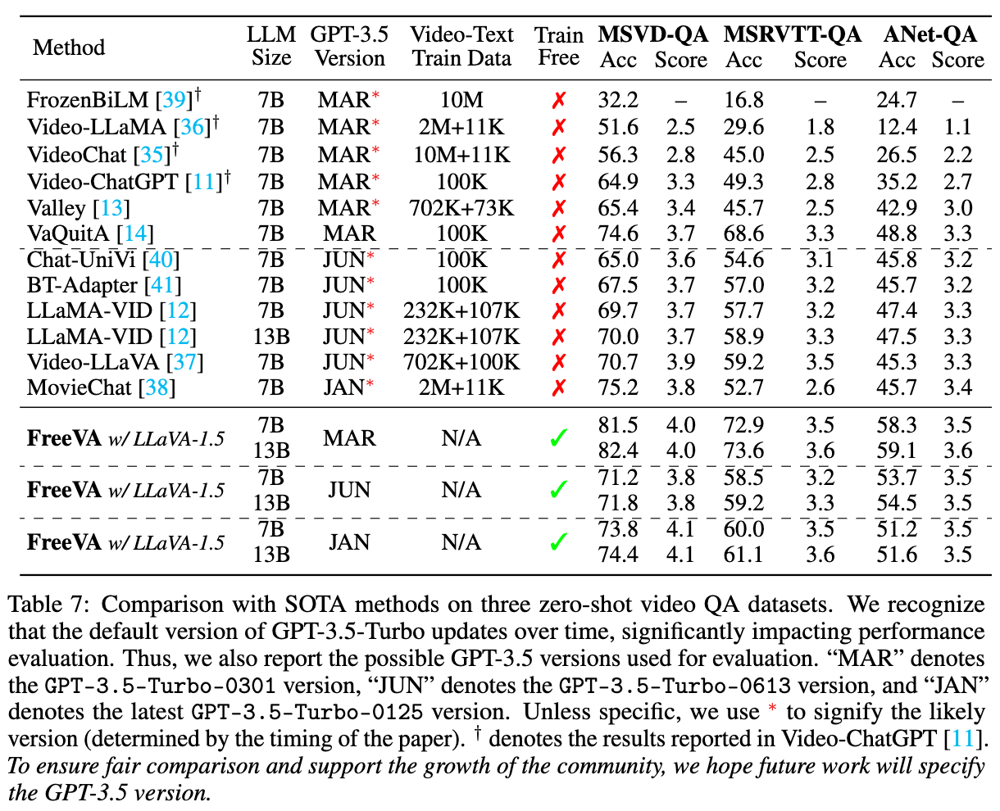

<div align="center">

<h2> FreeVA: Offline MLLM as Training-Free Video Assistant</h2>
<h5 align="center"> If you like our project, please give us a star ⭐ on GitHub for latest update.  </h2>

<!-- [](https://arxiv.org/abs/2301.00184) -->

[Wenhao Wu](https://whwu95.github.io/)

[The University of Sydney](https://www.sydney.edu.au/)

</div>

***


Welcome to **FreeVA** - a plug-and-play, simple yet effective study exploring the utilization of existing image MLLMs as video conversational models in a training-free manner.


## Main Take-aways
The study provides an essential, yet must-know baseline, and reveals several surprising findings: 
1) FreeVA, leveraging only offline image-based MLLM without additional training, excels in zero-shot video question-answering (e.g., MSVD-QA, ActivityNet-QA, and MSRVTT-QA), even surpassing state-of-the-art methods that involve video instruction tuning. 
2) While mainstream video-based MLLMs typically initialize with an image-based MLLM (\eg, LLaVA) and then fine-tune using video instruction tuning, the study indicates that utilizing the widely adopted VideoInstruct-100K for video instruction tuning doesn't actually lead to better performance compared to not training at all.
3) The commonly used evaluation metrics in existing works are significantly influenced by changes in the GPT-3.5 API version over time. If ignored, this could affect the fairness and uniformity of comparisons between different methods and impact the analysis and judgment of researchers in the field.


## News
- [] **[May 14, 2024]** Preprint will be released.
- [x] **[May 12, 2024]** Code has been released. Thanks for your star 😝.


## Overview

<div align="center">
An illustration of (a) an overview of the image MLLM inference process and (b) our
proposed FreeVA for zero-shot video inference using existing image MLLMs.



</div>


## Empirical Study
<div align="center">


</div>


## Running

FreeVA can be applied to any image-based MLLM, and its core code is straightforward, simply involving a temporal aggregation. Please refer to [temporal_aggregation]() for implementation details. 

Below, we provide guidance on running the code using LLaVA-1.5 as an example.


## Acknowledgement
We extend our sincere gratitude to these contributors:
- [LLaVA](https://github.com/haotian-liu/LLaVA): Visual Instruction Tuning
- [Video-ChatGPT](https://github.com/mbzuai-oryx/Video-ChatGPT): Video-ChatGPT: Towards Detailed Video Understanding via Large Vision and Language Models
  

<!-- ## BibTeX & Citation

If you use our code in your research or wish to refer to the results, please star 🌟 this repo and use the following BibTeX 📑 entry.

```bibtex
@article{FreeVA,
  title={FreeVA: Offline MLLM as Training-Free Video Assistant},
  author={Wu, Wenhao},
  booktitle={arXiv preprint arXiv:2311.15732},
  year={2024}
} -->